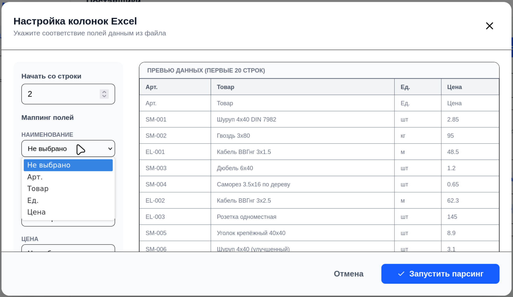
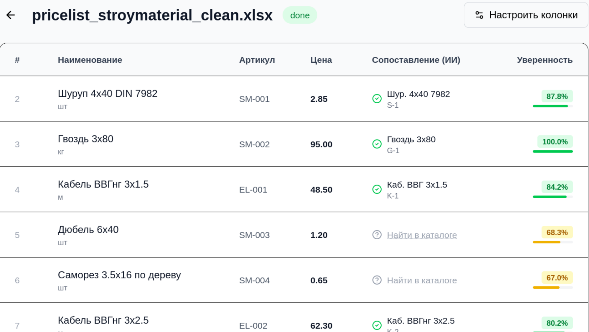
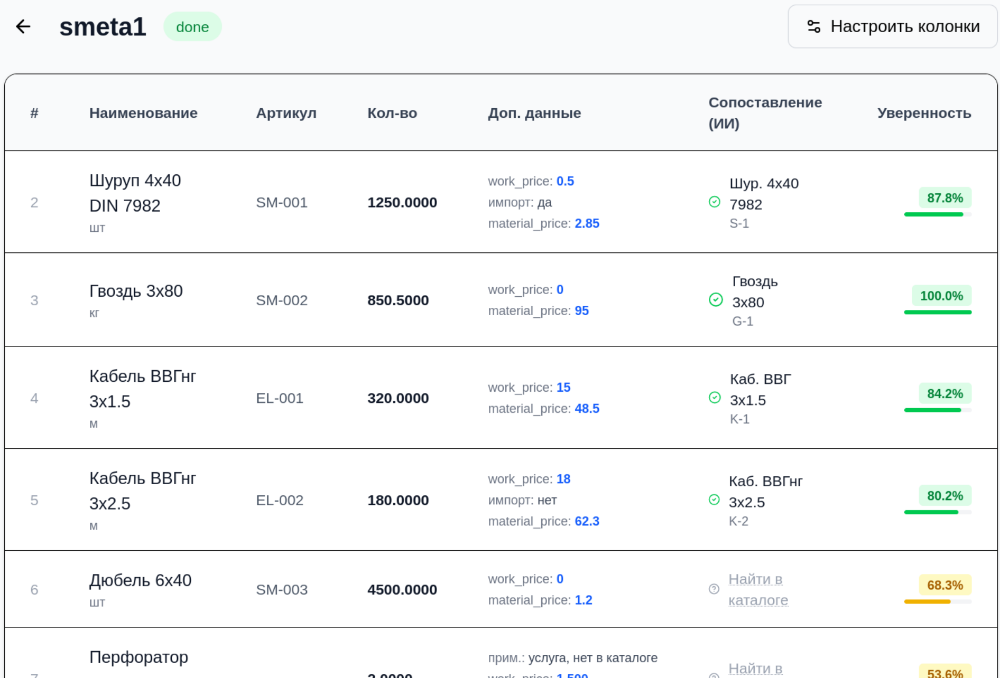

# Price Match System

Система для автоматического сопоставления имеющихся товаров с товарами поставщиков и смет.

### Авторизация


### Предпросмотр

### Сопоставление



### Смета   

## Быстрый запуск

### 1. Подготовка окружения

```bash
cp .env.example .env
```

заполнить

### 2. Запуск в Docker

```bash
docker compose up -d --build
```

### 3. Создание администратора

```bash
docker compose exec -it app bash

./manage.py createsuperuser # в контейнере
```

### 4. [http://localhost:8000](http://localhost:8000/api/v1/)

- **дока:** [http://localhost:8000/api/v1/docs/](http://localhost:8000/api/docs/)

